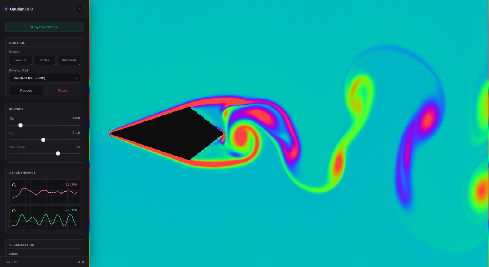

# **Gaulian CFD - Web Edition**

  

A lightweight, WebGL-powered Lattice-Boltzmann CFD playground - **architected by a generative AI** and refined into a browser-native simulation engine.

This repository hosts the web edition of *Gaulian CFD*: a real-time, 2D LBM fluid solver running entirely on the GPU via WebGL2. It’s built for exploration, rapid iteration, and the sheer joy of watching vortices bloom in your browser.

## **Key Features**
- Fully GPU-accelerated **LBM 2D fluid solver** implemented in GLSL (WebGL2)  
- Multiple visualization layers: **vorticity**, **velocity magnitude**, **pressure**  
- Vector-field overlays (BROKEN) and **live lift/drag charts**  
- Real-time controls for Reynolds number, inlet velocity, speed, palettes, and more

## **Quickstart (Local)**
1. Clone the repository  
2. Open `index.html` in your browser

## **Quickstart (Online)**
Interactive demo: [Gaulian CFD - Web Edition](https://ggaall98.github.io/gaulian-cfd-web/)
